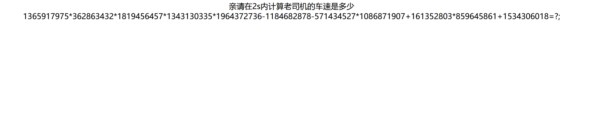
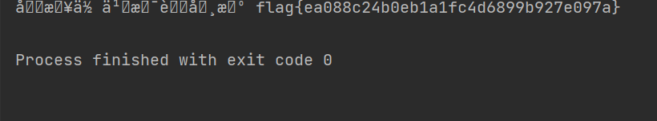
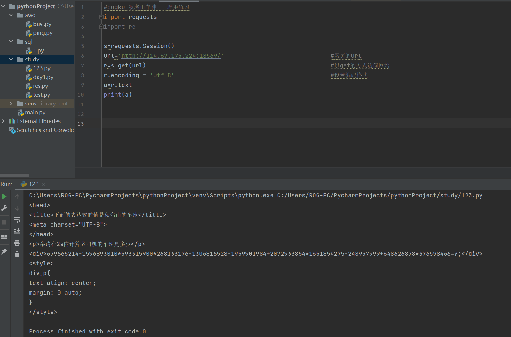
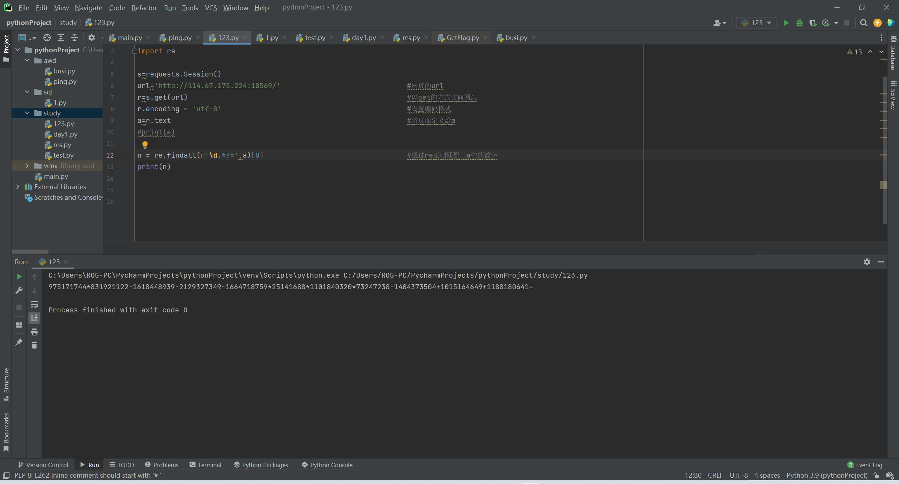
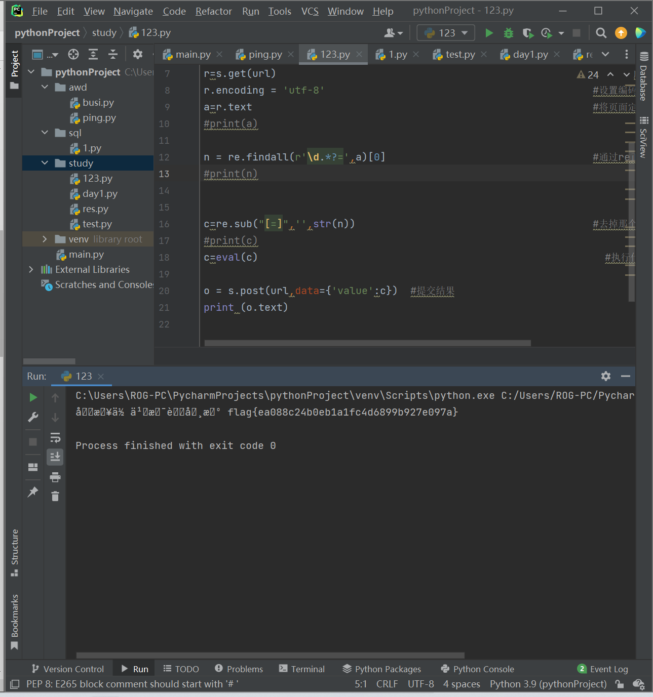

# bugku 秋名山车神

***get新知识：一些有关python爬虫的基本知识***

## 	解题部分

​			

题目中都是这样的大数字进行计算，并且需要短时间内计算，所以这不得不使用脚本进行解题，脚本如下

``` python
#bugku 秋名山车神 --爬虫练习
import requests
import re

s=requests.Session()
url='http://114.67.175.224:18569/'                              #网页的url
r=s.get(url)                                                    #以get的方式访问网站
r.encoding = 'utf-8'                                            #设置编码格式
a=r.text                                                        #将页面定义给a
#print(a)

n = re.findall(r'\d.*?=',a)[0]                                  #通过re正则匹配出a中的数字
#print(n)


c=re.sub("[=]",'',str(n))                                       #去掉那个多余的'='
#print(c)
c=eval(c)                                                         #执行代码==》计算

o = s.post(url,data={'value':c})  #提交结果
print (o.text)
```

运行结果：



 	## 	脚本分析

个人理解脚本分为三部分：1、获取数据    2、正则读取数据并处理   3、传输数据

1、获取数据

这部分利用了requests类的内置的方法，其中值得一提的是s=requests.Session()这部分，必须有目的是保持会话



2、正则读取数据并处理

这里用了两个re库中的两个内置函数

​	1、在import re中，(re.findall(pattern, string, flags=0))：返回string中所有与pattern相匹配的全部[字符串](https://so.csdn.net/so/search?q=字符串&spm=1001.2101.3001.7020)，得到数组

​	2、re.sub是个正则表达式方面的函数，用来实现通过正则表达式，实现比普通字符串的replace更加强大的替换功能；




3、传输数据

题目中提示用post传输所以




特别感谢：

[(27条消息) Bugku 秋名山车神_没有名字了。。的博客-CSDN博客](https://blog.csdn.net/m0_64815693/article/details/125539527?spm=1001.2014.3001.5502)

[(27条消息) python re模块(正则表达式) sub()函数详解_leo的学习之旅的博客-CSDN博客_python sub函数](https://blog.csdn.net/qq_43088815/article/details/90214217)

[(27条消息) Python---re.findall的用法_扫地di的博客-CSDN博客_python re.findall()用法](https://blog.csdn.net/jly164260234/article/details/83215924)