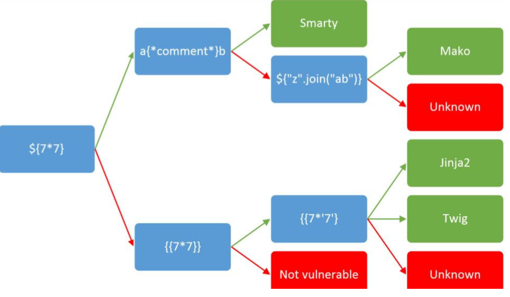
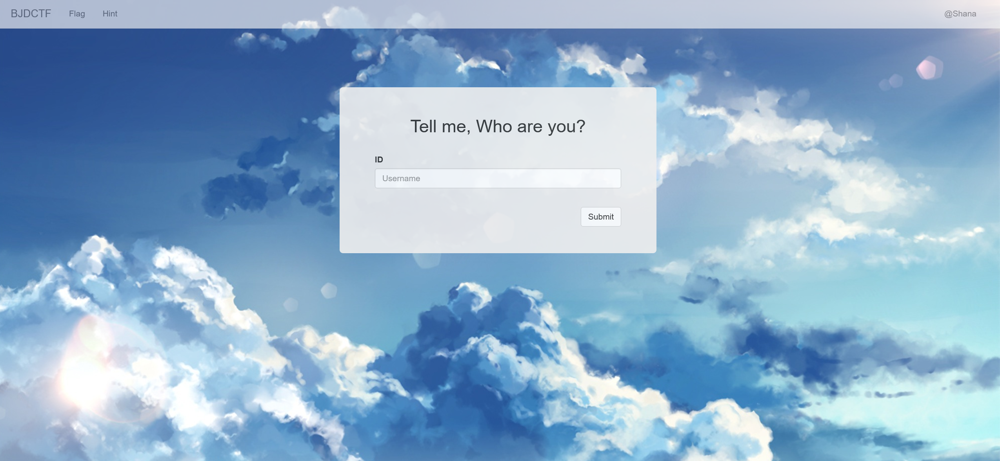
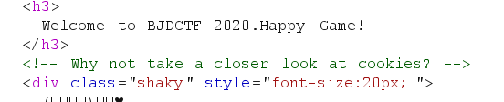
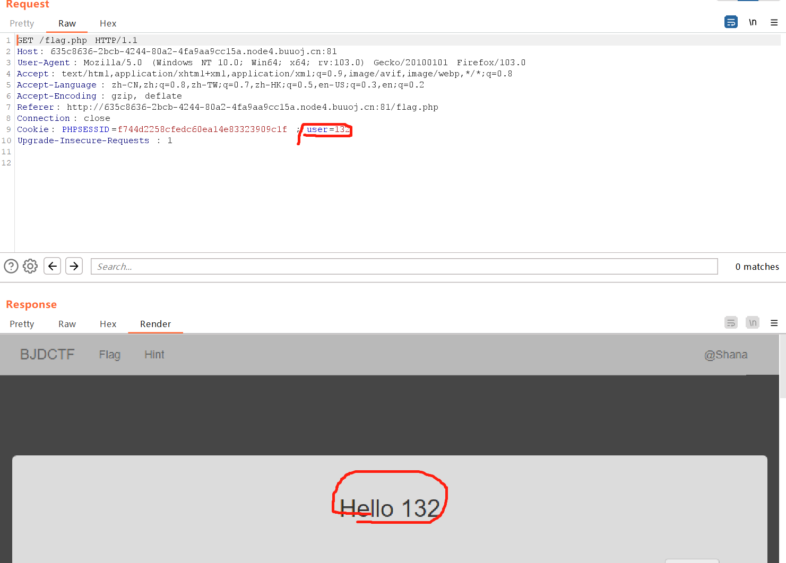
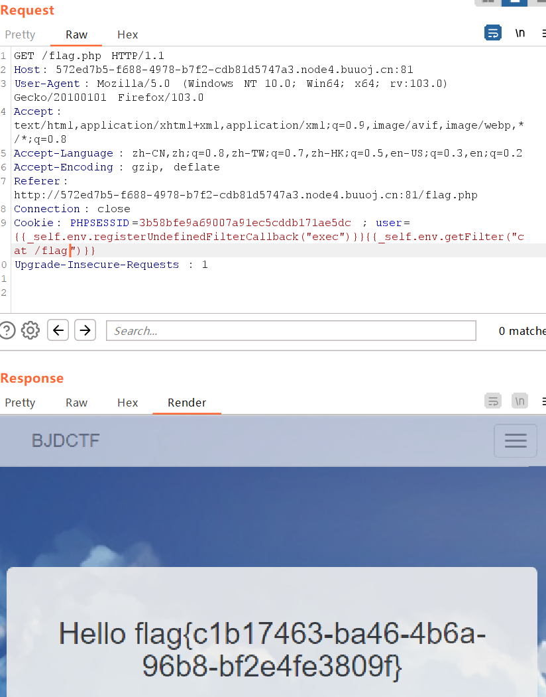
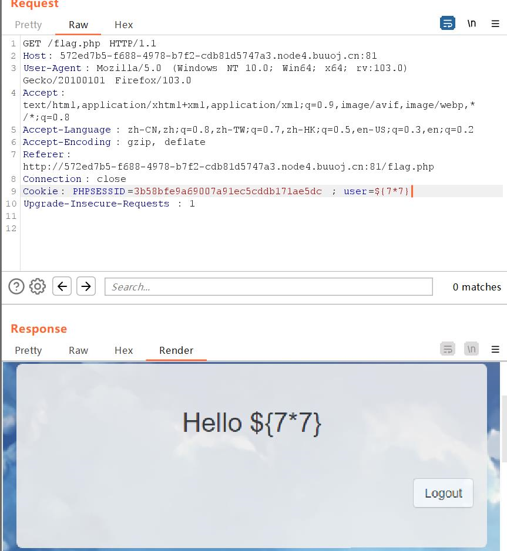
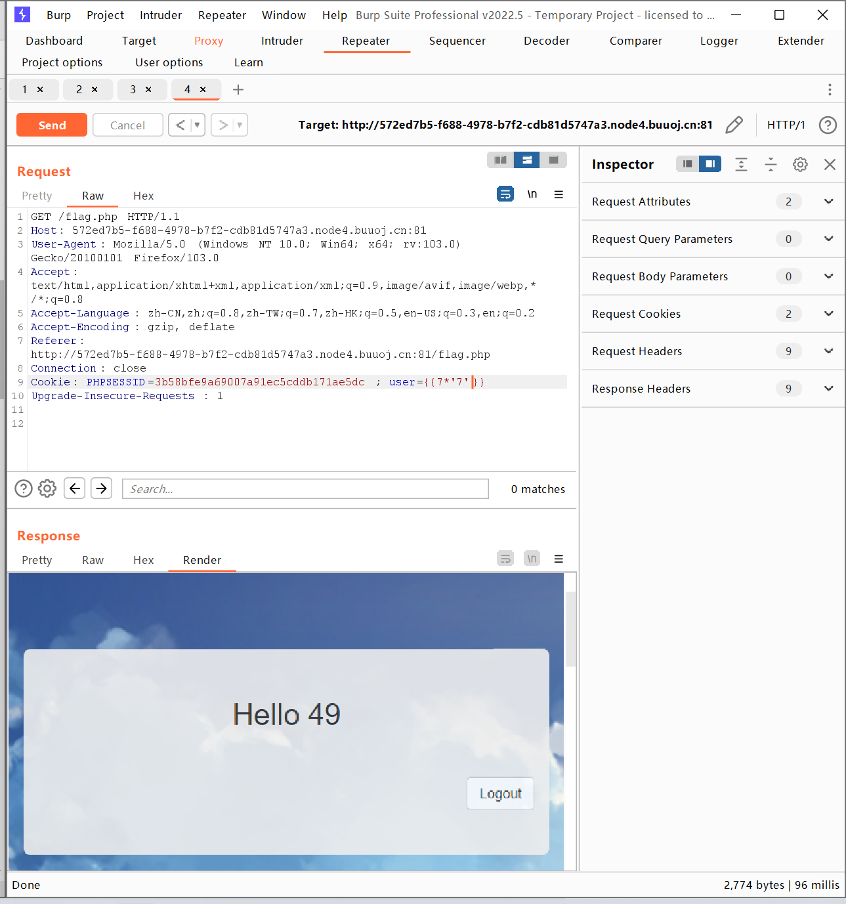
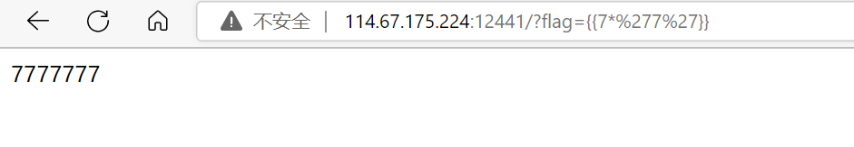

# BUUCTF [BJDCTF2020]Cookie is so stable


**这是一道关于php的SSTI注入**



这是检测ssti的一张思路图看不懂的小伙伴后面会有详解不要慌张；

## 解题过程

从题目看出这题应该解题的关键在于cookie



查看提示（hint下f12）



用bp抓包查看，发现在输入id登陆后cookie中出现了一个可控变量user



所以猜想后端接受到user输入后在进行输出类似一个模板所以想到了ssti注入（非官方思路猜想）

之后根据测试图测试发现是Twig模板

payload：

``` php
{{_self.env.registerUndefinedFilterCallback("exec")}}{{_self.env.getFilter("cat /flag")}}
```




# 关于模板判断的方法及回显

首先利用${7*7}进行测试，我们发现在页面上未进行一个算数运算，所以往下走



利用{{7*7}}测试


发现这里发生了运算，也就是图中下路中间部分的情况，这时候就要判断它是twig，还是jinja2

也就是利用{{7*'7'}}

如果是twig则返回结果应该是计算后的结果，反之亦然；



jinja2下测试{{7*'7'}}回显如下



（场景来源bugku-Simple_SSTI_1）