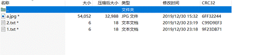
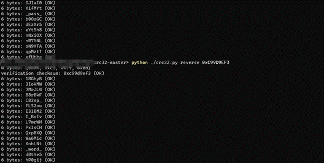
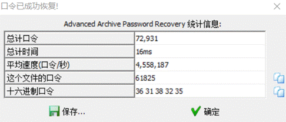
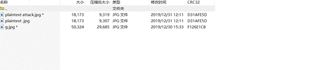
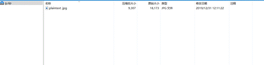
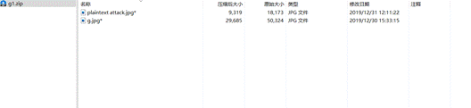
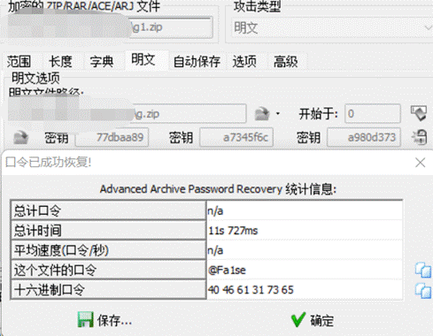
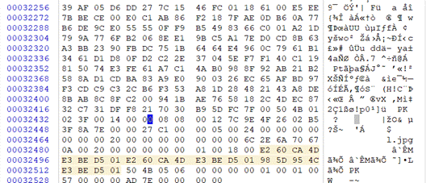
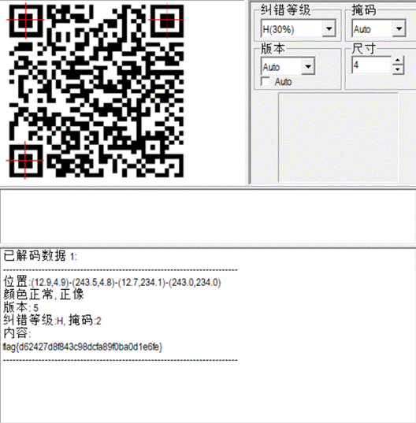

拿到附件，查看了下四个加密压缩包，貌似分别代表了不同的加密方式

第一个a.zip

看了下有三个文件，1.txt，2.txt

按照套路应该是CRC32爆破没错了，试试看

看到了两串很明显的字符，_pass_和_word_

所以压缩包密码应该就是_pass__word_，成功打开压缩包，得到1/4张二维码，继续

第二个f.zip

根据压缩包的提示应该是可以直接爆破，先试试最常规的纯数字

五位数字爆破成功密码是61825

第三个g.zip

根据文件名可以知道是明文爆破，这里由于会有一些压缩器的问题，所以就不分离出再进行压缩了，直接准备两个文件进行文件的删除

删除到如下两幅图所示，相当于加密的和不加密的分离开

进行明文爆破，成功

第四个压缩包l.zip

打开就一个文件，可能会是伪加密，试试修改下16进制数据

能够解压

这样四张分开的二维码图片就齐了，用PowerPoint拼起来看看，进行扫描

得到flag，flag{d62427d8f843c98dcfa89f0ba0d1e6fe}

 

 

 

 

 

 