# 迷失幻境

下载附件，拿到一个vmdk文件

打开取证大师进行取证

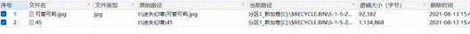

看到了有两个被删除的文件，给它导出

首先对图片没有啥发现，把另一个文件拖入winhex看看

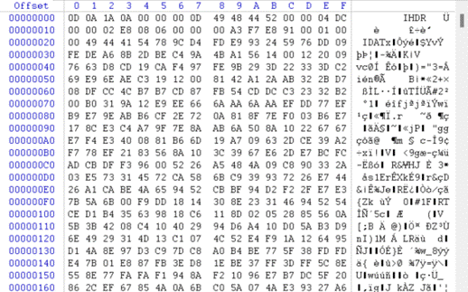

发现是png文件，但是少了个文件头，89504E47补充文件头，.png补充后缀

发现是和vmdk文件中的其它png文件相同

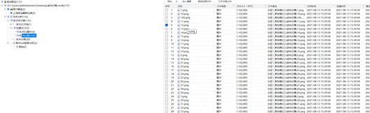

stegsolve查看了一下发现不是盲水印，于是想着合并看看

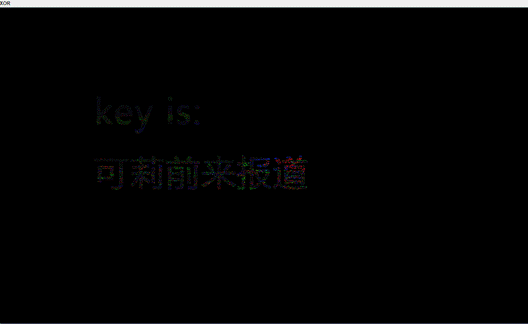

发现了一个key，还剩一张图片，图片带key，试试outguess

outguess -k "可莉前来报道" -r 1.jpg hidden.txt

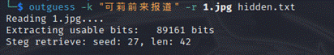

得到hidden.txt，打开得flag

DASCTF{f473a6fd2de17a0c5794414b3905ebbe}

# where_is_secret

下载附件，是一个加密压缩包和vig.txt

打开vig.txt看看

发现是维吉尼亚密码，那就在线网站解码

https://www.guballa.de/vigenere-solver

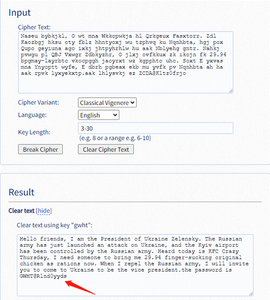

发现了压缩包的密码GWHT@R1nd0yyds，打开压缩包

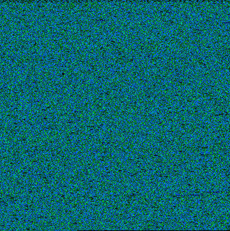

发现是一张bmp图片，应该是隐藏了一些信息再图片中，编写脚本

from PIL import Image

im = Image.open('out.bmp')

for i in range(im.height):

  for j in range(im.width):

​    rgb = im.getpixel((j,i))

​    print(chr((rgb[1]<<8)+rgb[2]),end="")

跑出来一大段文字，文字中查找到{，}之类的，发现flag应该就在文字当中，通过正则一些方法给它提取出来，手敲得到flag{h1d3_1n_th3_p1ctur3}

## 寻宝

下载附件，是一个无后缀文件，拉到010中查看

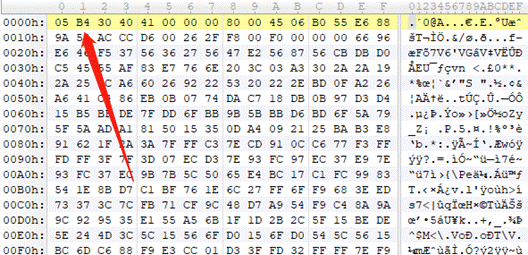

发现很像压缩包的504B0304的颠倒给它还原试试

f = open('寻宝','rb').read()

new = open('re.txt','w')

for i in f:

   str1 = "{:02X}".format(i)[-2:]

   str2 = str1[1]+str1[0]

   print(str2)

   new.write(str2)

跑出来的数值在010中整合成压缩包

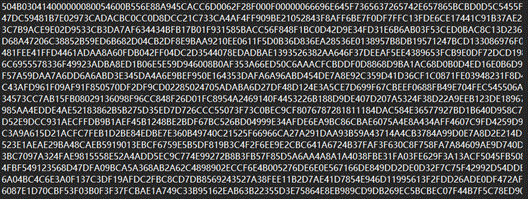

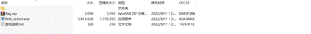

发现了一个加密压缩包和一个游戏，用ce修改器修改生命值为999并固定

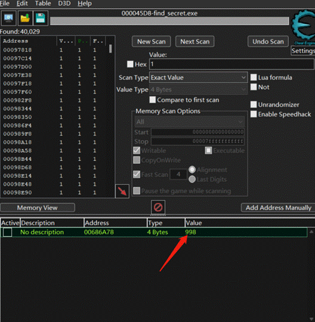

根据官方给出的三个提示，琴键对应数字，密码是三部分组成，有两种地形，占据密码两部分。 

每一关都截图，总共二十关，前四关的形状为变种的猪圈密码，后十六关的形状为曼彻斯特码

猪圈解码OWOH，曼彻斯特解码_a1_，因为题目还提示琴键，游戏里正好有几处特别明显的音 

调声，可以听出来是114514，因此最终密码是OWOH_a1_114514，解开压缩包

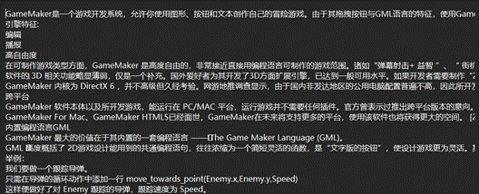

最后得到的是一个txt文件，知识点是零宽隐写，ctrl+a全选以后放入在线工具解得flag

http://330k.github.io/misc_tools/unicode_steganography.html

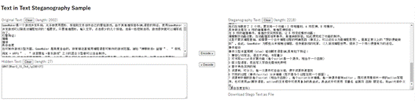

GWHT{Wher3_1S_Th4_1gI981O?}
